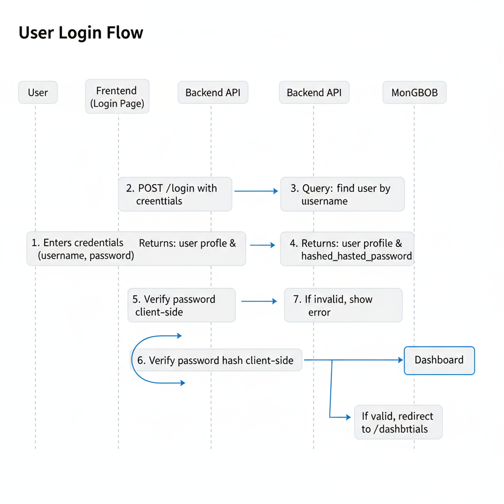
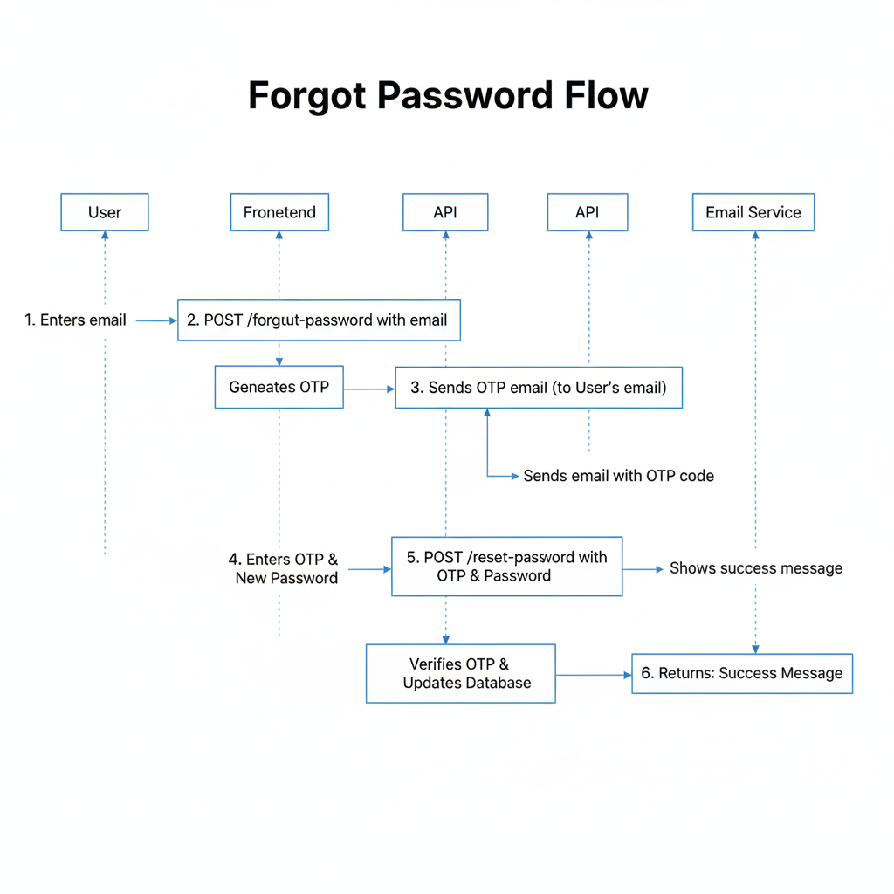
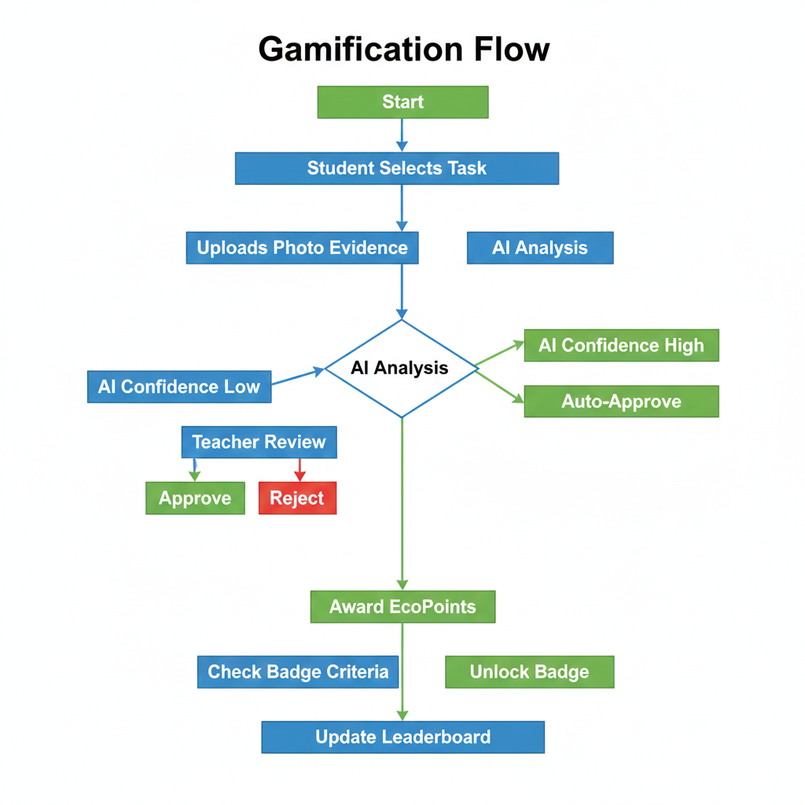

# EcoCred: Gamified Environmental Education Platform 🌿


> **EcoCred** is an AI-powered, gamified platform designed to empower students and schools to take climate action. It creates a verifiable ecosystem where environmental tasks are tracked, validated by AI, and rewarded with "EcoPoints."

---

## 📚 Table of Contents
- [Overview](#-overview)
- [Key Features](#-key-features)
- [System Architecture](#-system-architecture)
- [Database Schema](#-database-schema)
- [User Workflows](#-user-workflows)
- [Tech Stack](#-tech-stack)
- [API Reference](#-api-reference)
- [Getting Started](#-getting-started)

---

## 🎯 Overview

EcoCred bridges the gap between *learning* about climate change and *doing* something about it. Traditional education often lacks practical application verification. EcoCred solves this by using AI to verify real-world actions (planting trees, segregating waste) uploaded by students.

### The EcoCred Ecosystem
1.  **Student Actions**: Students perform eco-friendly tasks.
2.  **AI Verification**: Detailed computer vision models analyze proof photos.
3.  **Gamified Rewards**: Points, badges, and leaderboards drive sustained engagement.
4.  **School Analytics**: Institutions get measurable data on their environmental impact.

---

## 🌟 Key Features

### 🤖 AI-Verified Impact
- **Automated Validation**: Uses custom-trained **YOLOv8** and **ResNet50** models.
- **Smart Feedback**: Instant analysis of uploaded images (e.g., "Plant detected with 95% confidence").
- **Fraud Prevention**: Rejects irrelevant or duplicate submissions.

### 🎮 Advanced Gamification
- **EcoPoints Engine**: Points awarded based on task difficulty and impact.
- **Dynamic Badges**: Achievements like "Tree Planter", "Waste Warrior".
- **Leaderboards**: Compete at Class, School, and Regional levels.
- **Interactive UI**: Confetti celebrations and progress bars.

### 🏫 School Management
- **Teacher Dashboard**: Review flagged submissions, manage class rosters.
- **Impact Reports**: Track total waste saved, trees planted, and energy conserved.

---

## 🏗️ System Architecture

The system follows a modern **Microservices** pattern, separating the interactive Next.js frontend from the heavy Python AI processing layer.


**Core Components:**
-   **Frontend**: Next.js 14 (App Router) for a responsive student/teacher interface.
-   **Backend API**: Next.js API Routes handling business logic and auth.
-   **AI Service**: FastAPI (Python) service dedicated to image processing.
-   **Storage**: MongoDB (Data) and MinIO (Images).

---

## 🗄️ Database Schema

Our data model is designed for scalability and quick retrieval of user progress and gamification stats.


**Key Entities:**
-   **Users**: Stores profiles, roles, and point balances.
-   **Tasks**: Defines eco-activities and their point values.
-   **Submissions**: Links users to tasks with evidence and verification status.
-   **Badges**: Achievement criteria and metadata.

---

## 🔄 User Workflows

### 1. User Login Flow
Secure authentication process using custom JWT-based session management.


### 2. Forgot Password Flow
Secure password recovery using OTP via email.


### 3. Gamification Logic
The core loop of the application: Task -> Submission -> Verification -> Reward.


---

## 🛠️ Tech Stack

### Frontend
-   **Framework**: Next.js 14
-   **Styling**: Tailwind CSS, Shadcn UI
-   **Motion**: Framer Motion, GSAP

### Backend
-   **Runtime**: Node.js
-   **Database**: MongoDB Atlas
-   **Storage**: MinIO (S3 Compatible)

### AI Service
-   **Framework**: FastAPI
-   **ML Models**: YOLOv8, ResNet50
-   **Libraries**: PyTorch, Pillow, NumPy

---

## 🔌 API Reference

We provide a RESTful API for all platform capabilities.

-   **Base URL**: `http://localhost:3000/api`
-   **AI Service**: `http://localhost:8000`

For full endpoint details, see **[API_DOCUMENTATION.md](./API_DOCUMENTATION.md)**.

---

## 🚀 Getting Started

### Prerequisites
-   Node.js v18+
-   Python 3.9+
-   MongoDB

### Installation

1.  **Clone the Repository**
    ```bash
    git clone https://github.com/your-org/ecocred.git
    cd ecocred
    ```

2.  **Frontend Setup**
    ```bash
    npm install --legacy-peer-deps
    cp .env.example .env.local
    # Configure MONGODB_URI and MINIO keys
    npm run dev
    ```

3.  **AI Service Setup**
    ```bash
    cd backend
    python -m venv venv
    source venv/bin/activate
    pip install -r requirements.txt
    uvicorn main:app --reload --port 8000
    ```

---

## 📄 License

Distributed under the MIT License. See `LICENSE` for more information.

---

**Built with 💚 for the Planet.**
